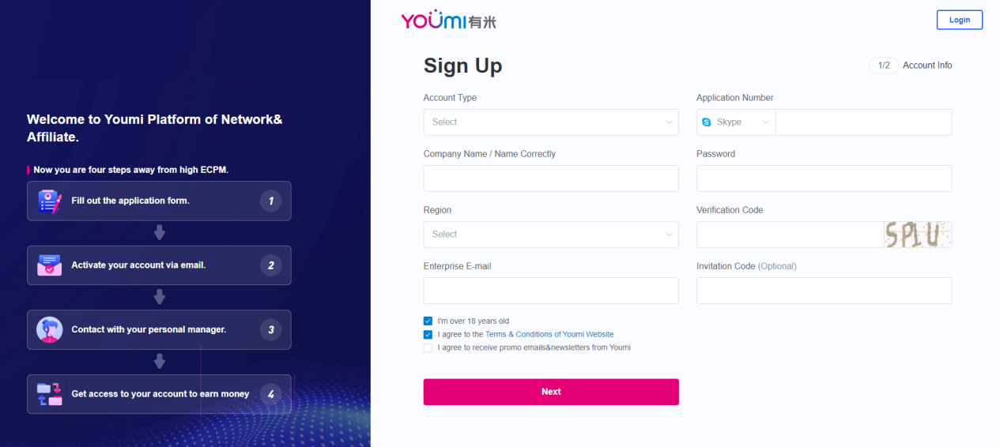
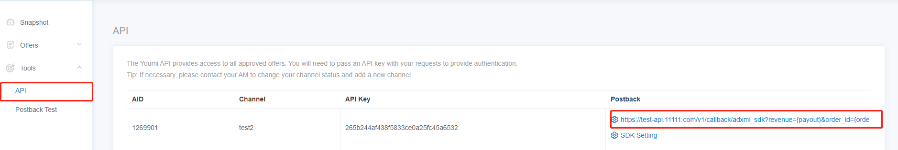
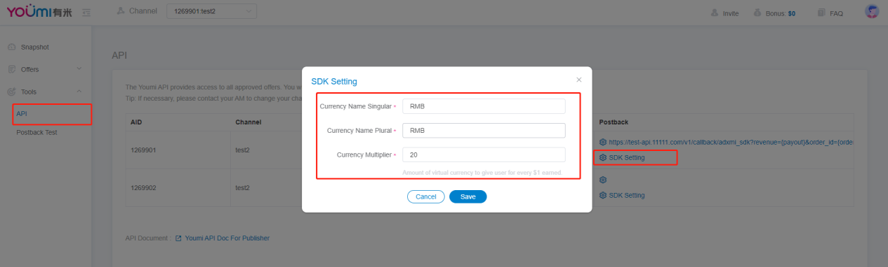

# 开发者对接SDK的具体步骤

## 目录

- [注册开发者账号](#注册开发者账号)
- [设置Postback](#设置Postback)
- [配置用户兑换的货币以及兑换比例](#配置用户兑换的货币以及兑换比例)
- [SDK对接](#SDK对接)
- [SDK广告位ICON](#SDK广告位ICON)

## 注册开发者账号

1. 在有米海外的官网注册开发者账号。注册链接：https://offers.youmi.net/register。注册内容填写完成后请在注册邮箱点击激活链接激活账号（有可能会被放到垃圾箱）；
2. 激活账号后，请联系BD进行账号审核。

## 设置Postback

1. 我们通过HTTP GET方法发送回调请求，请求失败时重试（HTTP响应代码5XX）。同一个转化多次回调是可能的，所以如果SDK回调需要带上order_id，网盟渠道不需要。

2. 回调参数说明：

   | 参数       | 说明                                                         |
   | ---------- | ------------------------------------------------------------ |
   | {order_id} | 有米广告平台生成的每个转化的唯一标识，同一个order_id表示同一个转化，开发者注意判断同一个order_id只可结算一次。 |
   | {ad}       | 有米平台的广告ID                                             |
   | {package}  | 广告包名                                                     |
   | {payout}   | 广告结算金额（美元）                                         |
   | {gaid}     | 用户的设备参数                                               |
   | {aff_sub}  | 开发者传过来的唯一用户标识                                   |
   | {aff_sub2} | 广告结算金额*后台配置的结算比例                              |

3. Postback 配置入口：

   [对外后台](https://offers.youmi.net/channel) - Tool - API 

## 配置用户兑换的货币以及兑换比例
开发者使用SDK之前需要配置货币以及货币的兑换比例，否则会影响正常测试。

| 参数                   | 说明                                                         |
| ---------------------- | ------------------------------------------------------------ |
| Currency Name Singular | 货币单数名称（例如Point,Coin）                               |
| Currency Name Plural   | 货币的复数名称（例如Points,Coins）                           |
| Currency Multiplier    | 兑换比例。用户每完成1美元的任务可获得的货币数量（有米按照美元和开发者结算） |

例子：
```
某个开发者的需求为：开发者APP的积分系统用Point。用户可用2000 Points 兑换1美元，并且提现。
开发者接入SDK，希望毛利率在30%。
设置如下:
Currency Name Singular：Point
Currency Name Plural：Points
Currency Multiplier：1400。（2000*（1-30%））
```

设置入口：
[对外后台](https://offers.youmi.net/channel)  - Tool - API 。

## SDK对接

### 对接文档：
1. 在项目的根目录下的build.gradle中引入mavenCentral公用仓库

```
buildscript {
    repositories {
        google()
        mavenCentral()
    }
}

allprojects {
    repositories {
        google()
        mavenCentral()
    }
}
```

2. 在app目录下的build.gradle中引入SDK库

```
dependencies {
    implementation 'io.github.youmi-obg:offerswall:2.0.0'
}
```

3. 在项目的build.gradle中的defaultConfig中加上 multiDexEnabled true

```
defaultConfig {
    applicationId "com.youmi.sdk.demo"
    minSdk 16
    targetSdk 30
    versionCode 1
    versionName "1.0"

    multiDexEnabled true
    testInstrumentationRunner "androidx.test.runner.AndroidJUnitRunner"
}
```


4. 在项目的AndroidManifest.xml中的<application>目录中加入tools:replace="android:theme"

```
<application
    android:name=".MyApp"
    android:allowBackup="true"
    android:icon="@mipmap/ic_launcher"
    android:label="@string/app_name"
    android:roundIcon="@mipmap/ic_launcher_round"
    android:supportsRtl="true"
    android:theme="@style/Theme.MyApplication"
    tools:replace="android:theme">
    <activity
        android:name=".MainActivity"
        android:exported="true">
        <intent-filter>
            <action android:name="android.intent.action.MAIN" />

            <category android:name="android.intent.category.LAUNCHER" />
        </intent-filter>
    </activity>
</application>
```

5. SDK的接入方式，在项目的Application类中的onCreate( )方法内，
   
   使用 YoumiOffersWallSdk.getInstance().setOfferWallCallback { s, l -> } 去注册本地回调，
   s为第三方传入的uid，l为每次完成任务成功后获取到的积分。（如果不需要本地回调可以不添加该函数）
   
   使用 YoumiOffersWallSdkgetInstance().getInstance().init(this,"your_aid")  
    "your_aid"为你在有米官网注册成功后的渠道aid，该aid不能为空，如果为空无法正常使用SDK功能

```
class MyApplication : Application() {

    override fun onCreate() {
        super.onCreate()
   
        YoumiOffersWallSdk.getInstance().setOfferWallCallback { s, l ->
          
        }

        YoumiOffersWallSdk.getInstance().init(this,"your_aid")
    }
 }
```

6. SDK广告墙的启动方式，在需要跳转到SDK的地方，添加代码
    YoumiOffersWallSdk.getInstance().startOffersWall(context，userId) 
    context为Context类的实例，userId为String类型，userId为该APP用户的唯一Id

```
btn_test.setOnClickListener {
    YoumiOffersWallSdk.getInstance().startOffersWall(context,"userId")
}
```

如果对SDK有任何问题，请联系我们
Email: mkt@youmi.net
‪WhatsApp: +8618028539642‬

### 注意事项：
启用SDK的时候时候需要带上用户的唯一id，userId。用户ID之后可用于结算，在Postback配置可以配置{aff_sub}给开发者回传。

## SDK广告位ICON

提供720*720的ICON


