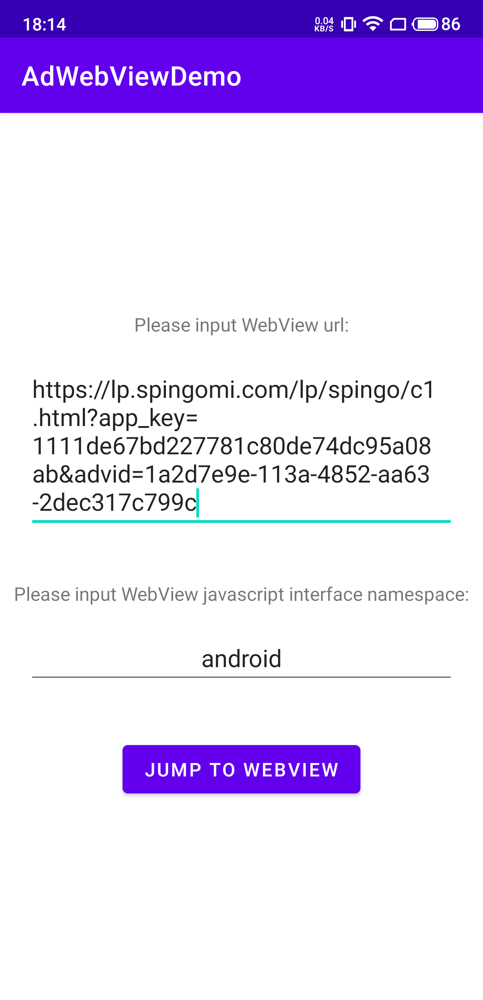
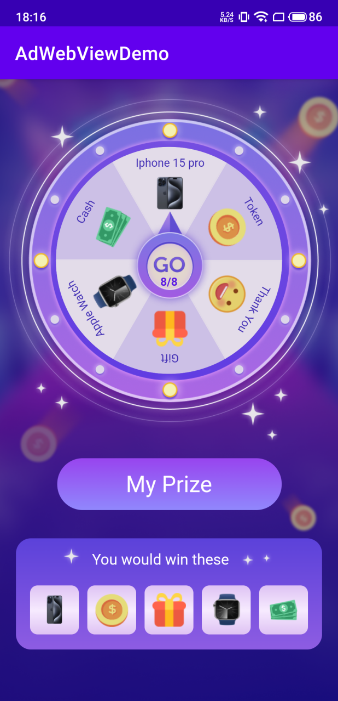

# 互动广告安卓WebView对接

## 1. 添加网络权限

在`AndroidManifest.xml`清单配置文件中添加网络权限：

```xml
<uses-permission android:name="android.permission.INTERNET" />
```

## 2. 配置WebView对http链接的支持

在`AndroidManifest.xml`中`application`节点添加配置WebView对http链接的支持

```xml
<application
    android:usesCleartextTraffic="true"
    android:networkSecurityConfig="@xml/network_security_config">
</application>
```

`network_security_config`：

```xml
<?xml version="1.0" encoding="utf-8"?>
<network-security-config>
    <base-config cleartextTrafficPermitted="true" />
</network-security-config>
```

## 3. 安卓11及以上版本的可见性配置

安卓目标版本为30及以上，也就是安卓11及以上，需要在`AndroidManifest.xml`中添加软件包可见性配置，因为WebView可能会涉及到apk安装跳转到Google Play或者浏览器中，需进行以下配置才能获取应用安装信息并进行三方跳转：

```xml
<queries>
    <intent>
        <action android:name="android.intent.action.MAIN" />
    </intent>
</queries>
```

或者按包名配置：

```xml
<queries>
    <package android:name="com.android.chrome" />
    <package android:name="com.android.vending" />
</queries>
```

## 4. 初始化WebView配置

在WebView所在`Activity`中初始化WebView相关配置，可根据实际的H5情况进行设置：

```java
WebSettings webSettings = webView.getSettings();
webSettings.setJavaScriptEnabled(true); // 支持js
webSettings.setDomStorageEnabled(true); // 开启dom storage api功能
webSettings.setDatabaseEnabled(true); // 开启database storage api功能
webSettings.setCacheMode(WebSettings.LOAD_DEFAULT); // 根据cache-control决定是否从网络上取数据
webSettings.setUseWideViewPort(true); // 将图片调整到适合webview的大小
webSettings.setLoadWithOverviewMode(true); // 缩放至屏幕的大小
webSettings.setLoadsImagesAutomatically(true); // 自动加载图片资源
webSettings.setDefaultTextEncodingName("utf-8"); // 设置编码格式
webSettings.setSupportZoom(true); // 支持使用屏幕控件或手势进行缩放
webSettings.setBuiltInZoomControls(true); // 使用其内置的变焦机制
webSettings.setDisplayZoomControls(false); // 不显示屏幕缩放控件

if (Build.VERSION.SDK_INT >= Build.VERSION_CODES.LOLLIPOP) {
    webSettings.setMixedContentMode(WebSettings.MIXED_CONTENT_COMPATIBILITY_MODE);
}

webSettings.setUserAgentString(String.format(
    Locale.getDefault(),
    "Mozilla/5.0 (Linux; <Android %s>; %s Build/%s) AppleWebKit/537.36 " +
    "(KHTML, like Gecko) Chrome/80.0.3987.149 Mobile Safari/537.36",
    Build.VERSION.RELEASE,
    Build.MODEL,
    Build.DISPLAY
));
```

## 5. WebView设置APK下载监听

```java
webView.setDownloadListener((url, userAgent, contentDisposition, mimetype, contentLength) -> {
    try {
        Uri uri = Uri.parse(url);
        Intent intent = new Intent(Intent.ACTION_VIEW, uri);
        intent.setFlags(Intent.FLAG_ACTIVITY_NEW_TASK);
        startActivity(intent);
    } catch (Exception e) {
        e.printStackTrace();
    }
});
```

## 6. 设置WebViewClient

重写`shouldOverrideUrlLoading()`方法，根据重定向得到url，判断特定域名或协议头/前缀执行不同的处理，比如跳转到GP，浏览器等：

```java
webView.setWebViewClient(new WebViewClient() {
    @Override
    public boolean shouldOverrideUrlLoading(WebView view, WebResourceRequest request) {
        String url = request.getUrl().toString();
        boolean result = false;
        try {
            if (url.startsWith("market:")
                || url.startsWith("https://play.google.com/store/")
                || url.startsWith("http://play.google.com/store/")) {
                Intent intent = new Intent(Intent.ACTION_VIEW);
                if (url.startsWith("market://details?")) {
                    result = OpenAppUtils.openByMarket(MainActivity.this, "com.android.vending", url);
                } else {
                    intent.setData(Uri.parse(url));
                    intent.setFlags(Intent.FLAG_ACTIVITY_NEW_TASK);
                    startActivity(intent);
                    result = true;
                }
            } else if (!url.startsWith("http://") && !url.startsWith("https://")) {
                result = OpenAppUtils.openUrl(MainActivity.this, url);
            } else if (url.contains("lz_open_browser=1")) {
                result = OpenAppUtils.openBrowser(WebViewActivity.this, url);
            }
        } catch (Exception e) {
            return false;
        }
        return result || super.shouldOverrideUrlLoading(view, url);
    }
});
```

## 7. 添加JavaScriptInterface安卓对象

支持JS进行安卓方法调用：

```java
String nameSpace = "android";
webView.addJavascriptInterface(new JsBridge(), nameSpace);

private class JsBridge {

    @JavascriptInterface
    public void jsAction(String event_name, String params) {
        try {
            if ("OPEN_URL".equals(event_name)) {
                startActivity(
                    params.startsWith("intent") ?
                        Intent.parseUri(params, Intent.URI_INTENT_SCHEME)
                        :
                        new Intent(Intent.ACTION_VIEW, Uri.parse(params))
                );
            }
        } catch (Exception e) {
            e.printStackTrace();
        }
    }

    @JavascriptInterface
    public void openBrowser(String url) {
        try {
            Intent intent = null;
            if (url.startsWith("intent")) {
                intent = Intent.parseUri(url, Intent.URI_INTENT_SCHEME);
            } else {
                intent = new Intent("android.intent.action.VIEW", Uri.parse(url));
            }
            if (intent != null) {
                if (isHw()) {
                    intent.setPackage(getDefaultBrowser());
                }
                intent.addCategory(Intent.CATEGORY_BROWSABLE);
                intent.setComponent(null);
                intent.setFlags(Intent.FLAG_ACTIVITY_NEW_TASK);
            }
            startActivity(intent);
        } catch (Exception e) {
            e.printStackTrace();
        }
    }

    @JavascriptInterface
    public void close() {
        finish();
    }

    @JavascriptInterface
    public void openWebview(String url) {
        // open a new page to display landing page
        // webView.loadUrl(url);
    }
}

private boolean isHw() {
    return "huawei".equalsIgnoreCase(Build.MANUFACTURER);
}

private String getDefaultBrowser() {
    String packageName = null, systemApp = null, userApp = null;
    List<String> userAppList = new ArrayList<>();
    Context context = getApplicationContext();
    Intent browserIntent = new Intent("android.intent.action.VIEW", Uri.parse("https://"));
    ResolveInfo resolveInfo = context.getPackageManager().resolveActivity(browserIntent, PackageManager.MATCH_DEFAULT_ONLY);
    if (resolveInfo != null && resolveInfo.activityInfo != null) {
        packageName = resolveInfo.activityInfo.packageName;
    }
    if (packageName == null || packageName.equals("android")) {
        List<ResolveInfo> lists = context.getPackageManager().queryIntentActivities(browserIntent, 0);
        for (ResolveInfo app : lists) {
            if ((app.activityInfo.flags & ApplicationInfo.FLAG_SYSTEM) != 0) {
                systemApp = app.activityInfo.packageName;
            } else {
                userApp = app.activityInfo.packageName;
                userAppList.add(userApp);
            }
        }
        if (userAppList.contains("com.android.chrome")) {
            packageName = "com.android.chrome";
        } else {
            if (systemApp != null) {
                packageName = systemApp;
            }
            if (userApp != null) {
                packageName = userApp;
            }
        }
    }
    return packageName;
}
```

## 8. 支持WebView网页后退

请支持网页的后退而不是直接关闭页面：

```java
@Override
public void onBackPressed() {
    if (webView == null) {
        super.onBackPressed();
        return;
    }
    if (webView.canGoBack()) {
        webView.goBack();
    } else {
        super.onBackPressed();
    }
}
```

## 9. 加载URL

```java
webView.loadUrl(url);
```

## 10. 备注：Demo App使用说明(见 [SpinGo Demo](https://github.com/youmi-obg/Documentation/blob/main/AdWebViewDemo))


在首页界面中支持url动态修改：输入/复制粘贴WebView网页url到第一行输入框，还有支持动态修改与各互动广告平台协议好的JS对象名（对应步骤7），不填或者不处理则默认值为`android`，url输入无误后点击按钮跳转到加载WebView的界面并显示。


