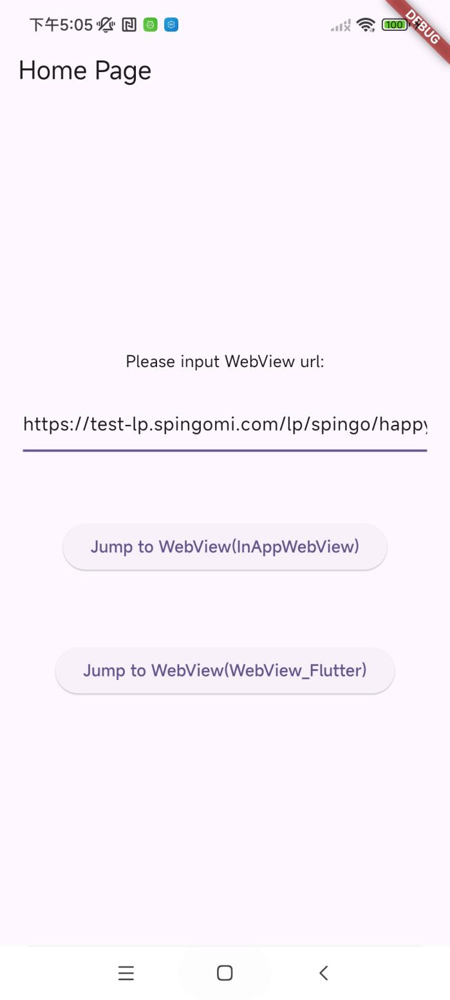

# 互动广告Flutter WebView对接

## 1. 添加网络权限（Android）

在 `AndroidManifest.xml` 清单配置文件中添加网络权限：

```xml
<uses-permission android:name="android.permission.INTERNET" />
```

## 2. 配置WebView对http链接的支持

在 `AndroidManifest.xml` 中 `application` 节点添加配置（如明确不支持http，请与互动广告平台运营说明）：

```xml
<application
    android:usesCleartextTraffic="true"
    android:networkSecurityConfig="@xml/network_security_config">
</application>
```

### `network_security_config`：

```xml
<?xml version="1.0" encoding="utf-8"?>
<network-security-config>
    <base-config cleartextTrafficPermitted="true" />
</network-security-config>
```

## 3. 安卓11及以上版本的可见性配置

安卓目标版本为30及以上（即安卓11+），需要在 `AndroidManifest.xml` 中添加软件包可见性配置：

```xml
<queries>
    <intent>
        <action android:name="android.intent.action.MAIN" />
    </intent>
</queries>
```

或者按包名配置：

```xml
<queries>
    <package android:name="com.android.chrome" />
    <package android:name="com.android.vending" />
</queries>
```

## 4. 引入Flutter插件依赖

在 `pubspec.yaml` 中添加 WebView 插件依赖：

```yaml
flutter_inappwebview: ^5.8.0
webview_flutter: ^4.8.0
```

## 5. 初始化WebView配置及跳转处理

### InAppWebView 插件实现

```dart
@override
Widget build(BuildContext context) {
  return Scaffold(
    appBar: AppBar(title: Text('WebView')),
    body: WillPopScope(
      onWillPop: _handleBackPress,
      child: InAppWebView(
        initialUrlRequest: URLRequest(url: Uri.parse(widget.linkUrl)),
        initialOptions: InAppWebViewGroupOptions(
          crossPlatform: InAppWebViewOptions(
            useShouldOverrideUrlLoading: true,
            javaScriptEnabled: true,
          ),
        ),
        onWebViewCreated: (controller) {
          _inAppWebViewController = controller;
        },
        onLoadStart: (controller, url) {
          currentUrl = url.toString();
        },
        onLoadStop: (controller, url) {
          isGoingBack = false;
        },
        shouldOverrideUrlLoading: (controller, navigationAction) async {
          final url = navigationAction.request.url.toString();
          if (url.startsWith("market:") ||
              url.startsWith("https://play.google.com/store/") ||
              url.startsWith("http://play.google.com/store/")) {
            if (url.startsWith("market://details?")) {
              openMarket("com.android.vending", url);
            } else {
              openBrowser(url);
            }
            return NavigationActionPolicy.CANCEL;
          } else if (!url.startsWith("http") && !url.startsWith("https")) {
            if (url.startsWith("android-app://") || url.startsWith("intent://")) {
              openBrowser(mOverrideLegalWebViewUrl);
              if (await _inAppWebViewController.canGoBack()) {
                _inAppWebViewController.goBack();
              }
            }
            return NavigationActionPolicy.CANCEL;
          } else if (url.contains("lz_open_browser=1")) {
            openBrowser(url);
            return NavigationActionPolicy.CANCEL;
          } else if (url.contains(".apk")) {
            openByScheme(url);
            return NavigationActionPolicy.CANCEL;
          } else {
            if (isGoingBack) {
              isGoingBack = false;
              return NavigationActionPolicy.CANCEL;
            }
            isGoingBack = false;
            return NavigationActionPolicy.ALLOW;
          }
        },
      ),
    ),
  );
}
```

### WebView Flutter 插件实现

```dart
@override
void initState() {
  super.initState();
  _controller = WebViewController()
    ..setJavaScriptMode(JavaScriptMode.unrestricted)
    ..setNavigationDelegate(NavigationDelegate(
      onPageStarted: (url) {
        currentUrl = url;
        print("onPageStarted: $url");
      },
      onPageFinished: (url) {
        isGoingBack = false;
        print("onPageFinished: $url");
      },
      onNavigationRequest: (request) async {
        mOverrideLegalWebViewUrl = widget.linkUrl;
        if (request.url.startsWith("http") || request.url.startsWith("https")) {
          mOverrideLegalWebViewUrl = request.url;
        }
        if (request.url.startsWith("market:") ||
            request.url.startsWith("https://play.google.com/store/") ||
            request.url.startsWith("http://play.google.com/store/")) {
          if (request.url.startsWith("market://details?")) {
            openMarket("com.android.vending", request.url);
          } else {
            openBrowser(request.url);
          }
          return NavigationDecision.prevent;
        } else if (!request.url.startsWith("http") && !request.url.startsWith("https")) {
          if (request.url.startsWith("android-app://") || request.url.startsWith("intent://")) {
            openBrowser(mOverrideLegalWebViewUrl);
            if (await _controller.canGoBack()) {
              _controller.goBack();
            }
          }
          return NavigationDecision.prevent;
        } else if (request.url.contains("lz_open_browser=1")) {
          openBrowser(request.url);
          return NavigationDecision.prevent;
        } else if (request.url.contains(".apk")) {
          openByScheme(request.url);
          return NavigationDecision.prevent;
        } else {
          if (isGoingBack) {
            isGoingBack = false;
            return NavigationDecision.prevent;
          }
          isGoingBack = false;
          return NavigationDecision.navigate;
        }
      }))
    ..addJavaScriptChannel("openBrowser", onMessageReceived: (javaScriptMessage) {
      print(javaScriptMessage.message);
      openBrowserFromJs(javaScriptMessage.message);
    })
    ..loadRequest(Uri.parse(widget.linkUrl));
}
```

### 原生方法调用说明

为了便于处理打开浏览器、跳转Google商店或下载APK等操作，这里通过 `MethodChannel` 调用了自定义的安卓原生方法，您也可以根据需要直接使用Flutter方式实现类似跳转逻辑。

```dart
static const MethodChannel _channel = MethodChannel("openAppUtils");

void openMarket(String packageName, String marketPath) async {
  await _channel.invokeMethod("openMarket", {'packageName': packageName, 'marketPath': marketPath});
}

void openBrowser(String url) async {
  await _channel.invokeMethod("openBrowser", {'url': url});
}

void openByScheme(String url) async {
  await _channel.invokeMethod("openByScheme", {'url': url});
}

void openBrowserFromJs(String url) async {
  await _channel.invokeMethod("openBrowserFromJs", {'url': url});
}
```

具体注册方式和判断逻辑可参考 demo 中 android 模块下 `OpenAppUtilsPlugin`。

## 6. 正确处理网页返回

### InAppWebView：

```dart
Future<bool> _handleBackPress() async {
  final canGoBack = await _inAppWebViewController.canGoBack();
  if (canGoBack) {
    isGoingBack = true;
    _inAppWebViewController.goBack();
    return false;
  }
  isGoingBack = false;
  return true;
}
```

### WebView Flutter：

```dart
Future<bool> _handleBackPress() async {
  final canGoBack = await _controller.canGoBack();
  if (canGoBack) {
    isGoingBack = true;
    _controller.goBack();
    return false;
  }
  isGoingBack = false;
  return true;
}
```

## 7. 添加JavaScript通道支持JS调用Flutter方法

### InAppWebView：

在步骤5的 `onWebViewCreated` 中添加：

```dart
controller.addJavaScriptHandler(
  handlerName: "openBrowser",
  callback: (args) {
    print('H5 called Flutter with: $args');
    openBrowserFromJs(args[0].toString());
  },
);
```

### WebView Flutter：

参考步骤5中 `.addJavaScriptChannel("openBrowser")` 配置。

## 8. 界面销毁时清除WebView缓存资源

### InAppWebView：

```dart
@override
void dispose() {
  super.dispose();
  _inAppWebViewController.clearCache();
}
```

### WebView Flutter：

```dart
@override
void dispose() {
  super.dispose();
  _controller.clearCache();
  _controller.clearLocalStorage();
}
```

## 9. Demo App使用说明（见 [SpinGo Demo](https://github.com/youmi-obg/Documentation/blob/main/AdWebViewFlutterDemo)）

在首页界面中支持 URL 动态修改：  
输入/复制粘贴 WebView 网页 URL 到输入框，URL 输入无误后点击按钮（分别由 inappwebview 和 webview_flutter 插件实现）跳转到加载 WebView 的界面并显示页面内容。
