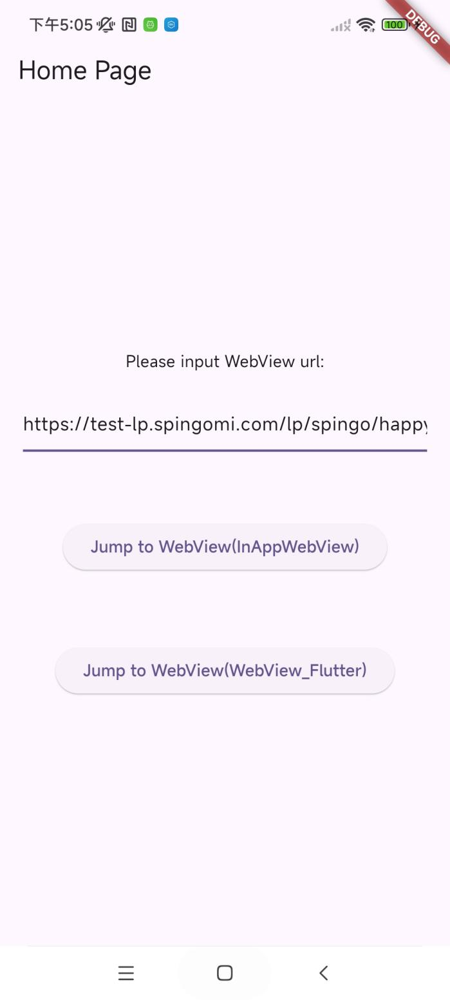

# Interactive Ads Flutter WebView Integration

## 1. Add Network Permission (Android)

Add the following network permission in your `AndroidManifest.xml` file:

```xml
<uses-permission android:name="android.permission.INTERNET" />
```

## 2. Enable WebView to Support HTTP Links

Add the following configuration under the `application` tag in `AndroidManifest.xml`.  
(*If HTTP is explicitly not supported, please confirm with the interactive ad platform.*)

```xml
<application
    android:usesCleartextTraffic="true"
    android:networkSecurityConfig="@xml/network_security_config">
</application>
```

### `network_security_config`:

```xml
<?xml version="1.0" encoding="utf-8"?>
<network-security-config>
    <base-config cleartextTrafficPermitted="true" />
</network-security-config>
```

## 3. Configure Visibility for Android 11 and Above

If your target SDK is 30 or above (Android 11+), add the following visibility configuration to `AndroidManifest.xml`, as WebView may trigger app installs via Google Play or open external browsers:

```xml
<queries>
    <intent>
        <action android:name="android.intent.action.MAIN" />
    </intent>
</queries>
```

Or specify package names directly:

```xml
<queries>
    <package android:name="com.android.chrome" />
    <package android:name="com.android.vending" />
</queries>
```

## 4. Add Flutter Plugin Dependencies

Add the following dependencies to your `pubspec.yaml` file:

```yaml
flutter_inappwebview: ^5.8.0
webview_flutter: ^4.8.0
```

## 5. Initialize WebView and Handle URL Navigation

### Using the `inappwebview` plugin

```dart
@override
Widget build(BuildContext context) {
  return Scaffold(
    appBar: AppBar(title: Text('WebView')),
    body: WillPopScope(
      onWillPop: _handleBackPress,
      child: InAppWebView(
        initialUrlRequest: URLRequest(url: Uri.parse(widget.linkUrl)),
        initialOptions: InAppWebViewGroupOptions(
          crossPlatform: InAppWebViewOptions(
            useShouldOverrideUrlLoading: true,
            javaScriptEnabled: true,
          ),
        ),
        onWebViewCreated: (controller) {
          _inAppWebViewController = controller;
        },
        onLoadStart: (controller, url) {
          currentUrl = url.toString();
        },
        onLoadStop: (controller, url) {
          isGoingBack = false;
        },
        shouldOverrideUrlLoading: (controller, navigationAction) async {
          final url = navigationAction.request.url.toString();
          if (url.startsWith("market:") ||
              url.startsWith("https://play.google.com/store/") ||
              url.startsWith("http://play.google.com/store/")) {
            if (url.startsWith("market://details?")) {
              openMarket("com.android.vending", url);
            } else {
              openBrowser(url);
            }
            return NavigationActionPolicy.CANCEL;
          } else if (!url.startsWith("http") && !url.startsWith("https")) {
            if (url.startsWith("android-app://") || url.startsWith("intent://")) {
              openBrowser(mOverrideLegalWebViewUrl);
              if (await _inAppWebViewController.canGoBack()) {
                _inAppWebViewController.goBack();
              }
            }
            return NavigationActionPolicy.CANCEL;
          } else if (url.contains("lz_open_browser=1")) {
            openBrowser(url);
            return NavigationActionPolicy.CANCEL;
          } else if (url.contains(".apk")) {
            openByScheme(url);
            return NavigationActionPolicy.CANCEL;
          } else {
            if (isGoingBack) {
              isGoingBack = false;
              return NavigationActionPolicy.CANCEL;
            }
            isGoingBack = false;
            return NavigationActionPolicy.ALLOW;
          }
        },
      ),
    ),
  );
}
```

### Using the `webview_flutter` plugin

```dart
@override
void initState() {
  super.initState();
  _controller = WebViewController()
    ..setJavaScriptMode(JavaScriptMode.unrestricted)
    ..setNavigationDelegate(NavigationDelegate(
      onPageStarted: (url) {
        currentUrl = url;
        print("onPageStarted: $url");
      },
      onPageFinished: (url) {
        isGoingBack = false;
        print("onPageFinished: $url");
      },
      onNavigationRequest: (request) async {
        mOverrideLegalWebViewUrl = widget.linkUrl;
        if (request.url.startsWith("http") || request.url.startsWith("https")) {
          mOverrideLegalWebViewUrl = request.url;
        }
        if (request.url.startsWith("market:") ||
            request.url.startsWith("https://play.google.com/store/") ||
            request.url.startsWith("http://play.google.com/store/")) {
          if (request.url.startsWith("market://details?")) {
            openMarket("com.android.vending", request.url);
          } else {
            openBrowser(request.url);
          }
          return NavigationDecision.prevent;
        } else if (!request.url.startsWith("http") && !request.url.startsWith("https")) {
          if (request.url.startsWith("android-app://") || request.url.startsWith("intent://")) {
            openBrowser(mOverrideLegalWebViewUrl);
            if (await _controller.canGoBack()) {
              _controller.goBack();
            }
          }
          return NavigationDecision.prevent;
        } else if (request.url.contains("lz_open_browser=1")) {
          openBrowser(request.url);
          return NavigationDecision.prevent;
        } else if (request.url.contains(".apk")) {
          openByScheme(request.url);
          return NavigationDecision.prevent;
        } else {
          if (isGoingBack) {
            isGoingBack = false;
            return NavigationDecision.prevent;
          }
          isGoingBack = false;
          return NavigationDecision.navigate;
        }
      }))
    ..addJavaScriptChannel("openBrowser", onMessageReceived: (javaScriptMessage) {
      print(javaScriptMessage.message);
      openBrowserFromJs(javaScriptMessage.message);
    })
    ..loadRequest(Uri.parse(widget.linkUrl));
}
```

### Native Method Invocation

To simplify handling for opening browsers, Google Play, or APK downloads, native Android methods are invoked via `MethodChannel`. You can also implement equivalent functionality using pure Flutter methods if preferred.

```dart
static const MethodChannel _channel = MethodChannel("openAppUtils");

void openMarket(String packageName, String marketPath) async {
  await _channel.invokeMethod("openMarket", {'packageName': packageName, 'marketPath': marketPath});
}

void openBrowser(String url) async {
  await _channel.invokeMethod("openBrowser", {'url': url});
}

void openByScheme(String url) async {
  await _channel.invokeMethod("openByScheme", {'url': url});
}

void openBrowserFromJs(String url) async {
  await _channel.invokeMethod("openBrowserFromJs", {'url': url});
}
```

Refer to the `OpenAppUtilsPlugin` under the Android module in the demo project for implementation details.

## 6. Handle Web Page Back Navigation Properly

### InAppWebView:

```dart
Future<bool> _handleBackPress() async {
  final canGoBack = await _inAppWebViewController.canGoBack();
  if (canGoBack) {
    isGoingBack = true;
    _inAppWebViewController.goBack();
    return false;
  }
  isGoingBack = false;
  return true;
}
```

### WebView Flutter:

```dart
Future<bool> _handleBackPress() async {
  final canGoBack = await _controller.canGoBack();
  if (canGoBack) {
    isGoingBack = true;
    _controller.goBack();
    return false;
  }
  isGoingBack = false;
  return true;
}
```

## 7. Add JavaScript Channel to Enable JS-Call-Flutter

### InAppWebView:

Add this in the `onWebViewCreated` callback in Step 5:

```dart
controller.addJavaScriptHandler(
  handlerName: "openBrowser",
  callback: (args) {
    print('H5 called Flutter with: $args');
    openBrowserFromJs(args[0].toString());
  },
);
```

### WebView Flutter:

See `addJavaScriptChannel("openBrowser")` in Step 5.

## 8. Clear WebView Cache on Page Disposal

### InAppWebView:

```dart
@override
void dispose() {
  super.dispose();
  _inAppWebViewController.clearCache();
}
```

### WebView Flutter:

```dart
@override
void dispose() {
  super.dispose();
  _controller.clearCache();
  _controller.clearLocalStorage();
}
```

## 9. Demo App Guide (See [SpinGo Demo](https://github.com/youmi-obg/Documentation/blob/main/AdWebViewFlutterDemo))



On the home screen, users can input or paste a WebView URL. Once a valid URL is provided, tap the corresponding button (for `inappwebview` or `webview_flutter`) to load and display the WebView page accordingly.
