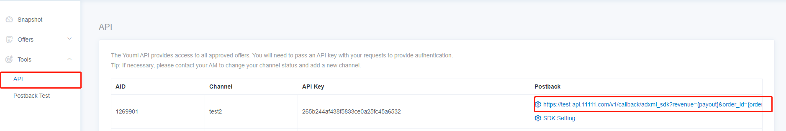

# How to integrate SDK

## Contents

- [How to integrate SDK](#how-to-integrate-sdk)
  - [Contents](#contents)
  - [Sign Up developer account](#sign-up-developer-account)
  - [Postback Configuration](#postback-configuration)
  - [User's currency exchange and exchange ratio Configuration](#users-currency-exchange-and-exchange-ratio-configuration)
  - [Android SDK Docking](#android-sdk-docking)
    - [Integration Documentation:](#integration-documentation)
    - [Precautions:](#precautions)
  - [ICON of SDK advertising space](#icon-of-sdk-advertising-space)

## Sign Up developer account

1. Register a developer account in the official website of Youmi Overseas. Registration link: https://offers.youmi.net/register.After completing the registration content, please click the activation link in the registered email address to activate the account (it may be in the spam box);

2. After activating the account, please contact BD for account review.


## Postback Configuration

1. We will send callback request via HTTP GET method when conversion happens, and will retry when request fails (HTTP response code 5XX). In order to avoid receiving the same callbacks repeatedly, developers need to configure parameters on postback to receive the order_id returned by us.

2. Callback parameter description

| Parameter  | Description                                                  |
| ---------- | ------------------------------------------------------------ |
| {order_id} | Conversion ID, a unique identifier for each conversion generated by Youmi. The same order_id means the same conversion. Developers should note that the same order_id can only be settled once. |
| {ad}       | Advertising ID of Youmi Platform                             |
| {package}  | The package name of this offer                               |
| {payout}   | The settled price (in USD) for this conversion               |
| {gaid}     | Google Advertising ID                                        |
| {aff_sub}  | Developer's user ID, the unique user ID passed by the developer |
| {aff_sub2} | payout* Currency Multiplier (Configured in the monetization platform for publishers). It is also the amount be settled with the user |

3. Where to configure postback:

[Monetization platform for publishers](https://offers.youmi.net/channel) - Tool - API



## User's currency exchange and exchange ratio Configuration

Developers should configure the currency and currency conversion ratio before using the SDK, otherwise it will affect the normal test.

| Parameter              | Description                                          |
| ---------------------- | ---------------------------------------------------- |
| Currency Name Singular | Name of the point in your app,example:point,coin etc |
| Currency Name Plural   | Plural of Currency Name,example:points,coins etc     |
| Currency Multiplier    | The exchange ratio                                   |

Example:
```
first, you should define how many points for 1 dollar, such as 2000 points for 1 dollar, and if you want to earn 30% of it and provide 70% to user, that is: 2000*70%=1400, than fill 1400 in the box
Set as follows:
Currency Name Singular: Point
Currency Name Plural: Points
Currency Multiplier: 1400
```

Where to set up:

[Monetization platform for publishers](https://offers.youmi.net/channel) - Tool - API


## Android SDK Docking

### Integration Documentation:

1. Add Maven repository to build.gradle in the root directory of your project

```gradle
buildscript {
    repositories {
        google()
        mavenCentral()
    }
}

allprojects {
    repositories {
        google()
        mavenCentral()
    }
}
```

2. Add Youmi Offer Wall SDK dependency to app's build.gradle

```gradle
dependencies {
    implementation 'io.github.youmi-obg:offerswall:2.7.6'
}
```

3. Add multiDexEnabled true to defaultConfig in app's build.gradle

```gradle
defaultConfig {
    applicationId "com.youmi.sdk.demo"
    minSdk 16
    targetSdk 30
    versionCode 1
    versionName "1.0"

    multiDexEnabled true
    testInstrumentationRunner "androidx.test.runner.AndroidJUnitRunner"
}
```

4. Add tools:replace="android:theme" to <application> in AndroidManifest.xml

```xml
<application
    android:name=".MyApp"
    android:allowBackup="true"
    android:icon="@mipmap/ic_launcher"
    android:label="@string/app_name"
    android:roundIcon="@mipmap/ic_launcher_round"
    android:supportsRtl="true"
    android:theme="@style/Theme.MyApplication"
    tools:replace="android:theme">
    <activity
        android:name=".MainActivity"
        android:exported="true">
        <intent-filter>
            <action android:name="android.intent.action.MAIN" />

            <category android:name="android.intent.category.LAUNCHER" />
        </intent-filter>
    </activity>
</application>
```

5. SDK integration method, in the onCreate() method of the project's Application class:

   Use YoumiOffersWallSdk.getInstance().setOfferWallCallback { s, l -> } to register local callback,
   s is the uid passed by third party, l is the points obtained after each successful task completion. (You don't need to add this function if you don't need local callback)

   Use YoumiOffersWallSdk.getInstance().init(this,"your_aid")
   "your_aid" is the channel aid after you successfully register on Youmi official website. This aid cannot be empty, otherwise the SDK function cannot be used normally.

```kotlin
class MyApplication : Application() {

    override fun onCreate() {
        super.onCreate()

        YoumiOffersWallSdk.getInstance().setOfferWallCallback { s, l ->

        }

        YoumiOffersWallSdk.getInstance().init(this,"your_aid")
    }
 }
```

6. SDK offer wall startup method, where you need to jump to the SDK, add code
   YoumiOffersWallSdk.getInstance().startOffersWall(context, userId)
   context is an instance of Context class, userId is String type, userId is the unique ID of the APP user

```kotlin
btn_test.setOnClickListener {
    YoumiOffersWallSdk.getInstance().startOffersWall(context,"userId")
}
```

If you have any questions about the SDK, please contact us:
- Email: mkt@youmi.net
- WhatsApp: +86 180 2853 9642

### Precautions:

When enabling the SDK, userId (User's unique id) is mandatory. The user ID can be used for settlement, the related parameter is {aff_sub} in postback, which can be fired back to developer.

## ICON of SDK advertising space

Provide 720*720 ICON


