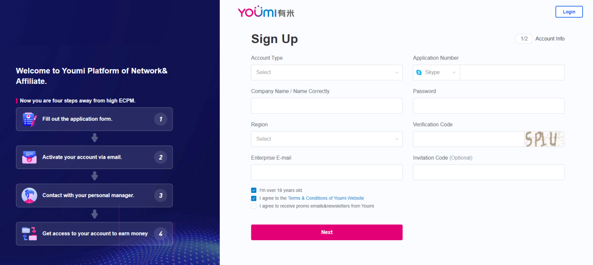
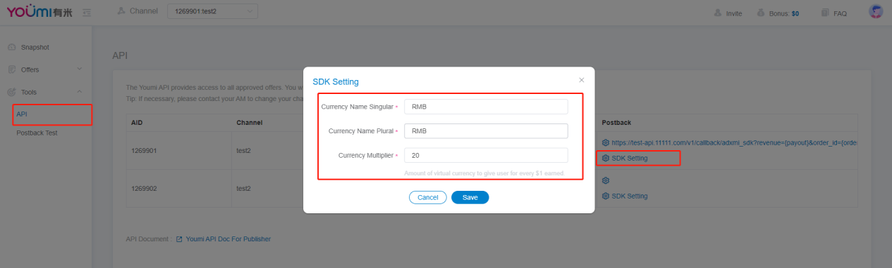

# 开发者对接 SDK 的具体步骤

## 目录

- [开发者对接 SDK 的具体步骤](#开发者对接-sdk-的具体步骤)
  - [目录](#目录)
  - [注册开发者账号 {#sign-up-developer-account}](#注册开发者账号-sign-up-developer-account)
  - [设置 Postback {#postback-configuration}](#设置-postback-postback-configuration)
  - [配置用户兑换的货币以及兑换比例 {#users-currency-exchange-and-exchange-ratio-configuration}](#配置用户兑换的货币以及兑换比例-users-currency-exchange-and-exchange-ratio-configuration)
  - [SDK 对接 {#android-sdk-docking}](#sdk-对接-android-sdk-docking)
    - [对接文档：](#对接文档)
    - [注意事项：](#注意事项)
  - [SDK 广告位 ICON {#icon-of-sdk-advertising-space}](#sdk-广告位-icon-icon-of-sdk-advertising-space)

## 注册开发者账号 {#sign-up-developer-account}

1. 在有米海外的官网注册开发者账号。注册链接：https://offers.youmi.net/register。注册内容填写完成后请在注册邮箱点击激活链接激活账号（有可能会被放到垃圾箱）；

2. 激活账号后，请联系 BD 进行账号审核。



## 设置 Postback {#postback-configuration}

1. 我们通过 HTTP GET 方法发送回调请求，请求失败时重试（HTTP 响应代码 5XX）。同一个转化多次回调是可能的，所以如果 SDK 回调需要带上 order_id，网盟渠道不需要。

2. 回调参数说明：

| 参数       | 说明                                                         |
| ---------- | ------------------------------------------------------------ |
| {order_id} | 有米广告平台生成的每个转化的唯一标识，同一个 order_id 表示同一个转化，开发者注意判断同一个 order_id 只可结算一次。 |
| {ad}       | 有米平台的广告 ID                                             |
| {package}  | 广告包名                                                     |
| {payout}   | 广告结算金额（美元）                                         |
| {gaid}     | 用户的设备参数                                               |
| {aff_sub}  | 开发者传过来的唯一用户标识                                   |
| {aff_sub2} | 广告结算金额 * 后台配置的结算比例                              |

3. Postback 配置入口：

[对外后台](https://offers.youmi.net/channel) - Tool - API


## 配置用户兑换的货币以及兑换比例 {#users-currency-exchange-and-exchange-ratio-configuration}

开发者使用 SDK 之前需要配置货币以及货币的兑换比例，否则会影响正常测试。

| 参数                   | 说明                                                         |
| ---------------------- | ------------------------------------------------------------ |
| Currency Name Singular | 货币单数名称（例如 Point, Coin）                               |
| Currency Name Plural   | 货币的复数名称（例如 Points, Coins）                           |
| Currency Multiplier    | 兑换比例。用户每完成 1 美元的任务可获得的货币数量（有米按照美元和开发者结算） |

示例：
```
某个开发者的需求为：开发者 APP 的积分系统用 Point。用户可用 2000 Points 兑换 1 美元，并且提现。
开发者接入 SDK，希望毛利率在 30%。

设置如下:
- Currency Name Singular：Point
- Currency Name Plural：Points
- Currency Multiplier：1400。（2000 * (1-30%)）
```

设置入口：
[对外后台](https://offers.youmi.net/channel) - Tool - API 。



## SDK 对接 {#android-sdk-docking}

### 对接文档：

1. 在项目的根目录下的 build.gradle 中引入 mavenCentral 公用仓库

```gradle
buildscript {
    repositories {
        google()
        mavenCentral()
    }
}

allprojects {
    repositories {
        google()
        mavenCentral()
    }
}
```

2. 在 app 目录下的 build.gradle 中引入 SDK 库

```gradle
dependencies {
    implementation 'io.github.youmi-obg:offerswall:2.7.6'
}
```

3. 在项目的 build.gradle 中的 defaultConfig 中加上 multiDexEnabled true

```gradle
defaultConfig {
    applicationId "com.youmi.sdk.demo"
    minSdk 16
    targetSdk 30
    versionCode 1
    versionName "1.0"

    multiDexEnabled true
    testInstrumentationRunner "androidx.test.runner.AndroidJUnitRunner"
}
```

4. 在项目的 AndroidManifest.xml 中的 &lt;application&gt; 目录中加入 tools:replace="android:theme"

```xml
<application
    android:name=".MyApp"
    android:allowBackup="true"
    android:icon="@mipmap/ic_launcher"
    android:label="@string/app_name"
    android:roundIcon="@mipmap/ic_launcher_round"
    android:supportsRtl="true"
    android:theme="@style/Theme.MyApplication"
    tools:replace="android:theme">
    <activity
        android:name=".MainActivity"
        android:exported="true">
        <intent-filter>
            <action android:name="android.intent.action.MAIN" />

            <category android:name="android.intent.category.LAUNCHER" />
        </intent-filter>
    </activity>
</application>
```

5. SDK 的接入方式，在项目的 Application 类中的 onCreate() 方法内，

   使用 YoumiOffersWallSdk.getInstance().setOfferWallCallback { s, l -> } 去注册本地回调，
   s 为第三方传入的 uid，l 为每次完成任务成功后获取到的积分。（如果不需要本地回调可以不添加该函数）

   使用 YoumiOffersWallSdk.getInstance().init(this,"your_aid")
   "your_aid" 为你在有米官网注册成功后的渠道 aid，该 aid 不能为空，如果为空无法正常使用 SDK 功能。

```kotlin
class MyApplication : Application() {

    override fun onCreate() {
        super.onCreate()

        YoumiOffersWallSdk.getInstance().setOfferWallCallback { s, l ->

        }

        YoumiOffersWallSdk.getInstance().init(this,"your_aid")
    }
 }
```

6. SDK 广告墙的启动方式，在需要跳转到 SDK 的地方，添加代码
   YoumiOffersWallSdk.getInstance().startOffersWall(context, userId)
   context 为 Context 类的实例，userId 为 String 类型，userId 为该 APP 用户的唯一 Id。

```kotlin
btn_test.setOnClickListener {
    YoumiOffersWallSdk.getInstance().startOffersWall(context,"userId")
}
```

如果对 SDK 有任何问题，请联系我们：

- **Email**: mkt@youmi.net
- **WhatsApp**: +86 180 2853 9642

### 注意事项：

启用 SDK 的时候需要带上用户的唯一 id，userId。用户 ID 之后可用于结算，在 Postback 配置可以配置 {aff_sub} 给开发者回传。

## SDK 广告位 ICON {#icon-of-sdk-advertising-space}

提供 720*720 的 ICON


