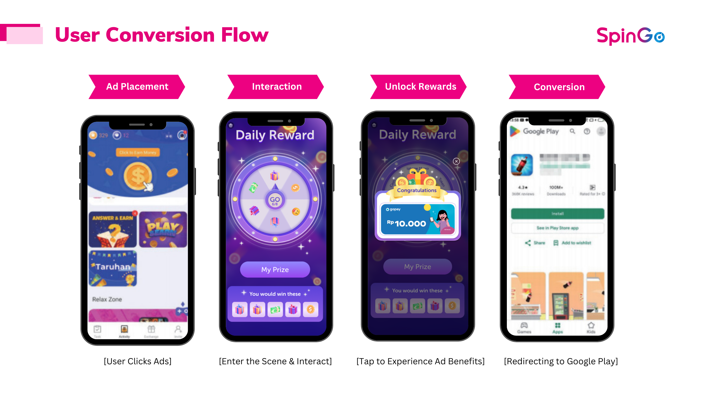
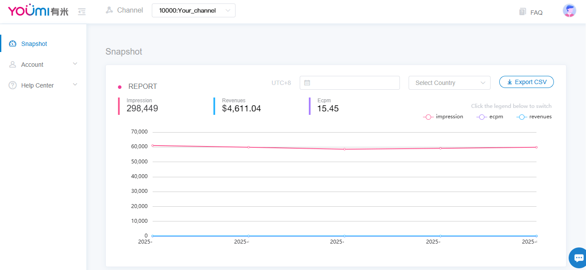

# SpinGo 互动广告接入指南

## 1. 接入方式

- SpinGo 互动广告采用 H5 形式对接，适配各种形式的展示位置。我们为每个广告位提供一个 H5 链接，例如 `https://lp.spingomi.com/lp/spingo/c1.html?app_key={your_app_key}&advid={gaid | idfa}`。

开发者伙伴仅需提供一个广告位，并填充链接中的参数即可，点击广告位后在外部浏览器或 app 内 webview 打开相应的 H5 页面。

参数规则：
  - Android 流量：在链接中传递 `advid={gaid}`（Google Ads ID）。
  - iOS 流量：传递 `advid={idfa}`（Identifier for Advertising）。如果渠道无法获取 IDFA，则不需要 advid 参数。

- 对于 WebView 形式接入，建议参考以下文档进行必要的调整，以兼容各种广告跳转场景：
  - [互动广告 Android WebView 接入](interactive-ads-webview.md)
  - [互动广告 Flutter WebView 接入](interactive-ads-webview-flutter.md)
  - [互动广告 iOS WebView 接入](https://github.com/youmi-obg/Documentation/blob/main/AdWebviewIOSDemo/README.md)

## 2. 广告位选择

- 互动广告除了能以开屏、插屏、Banner、信息流等常规形式展现外，还可在各种非标广告位进行展现，例如悬浮图标、推送消息、Tab 功能入口、签到弹窗等。其中能吸引用户主动点击的广告位更为推荐，例如悬浮图标、Banner 等广告位，这些广告位的 eCPM 相比其他广告位整体也会更高。

## 3. 数据展示

- 对接上线后，可在开发者后台查看相关展示收入数据：https://offers.youmi.net/snapshot

